# Microbiome Analysis

Here we will provide a selection of analytical approaches, tools, and utilities for the processing of microbiome data derived from either 16S rRNA amplicon sequencing or shotgun metagenomics.

## Table of Contents

  - [Processing of raw data](#processing-of-raw-data)
  - [Downstream preprocessing - 16S rRNA amplicon sequencing](#downstream-preprocessing---16s-rrna-amplicon-sequencing)
    - [Load bacterial 16S data](#load-bacterial-16s-data)
    - [Prepare metadata](#prepare-metadata)
    - [Import data into a phyloseq object](#import-data-into-a-phyloseq-object)
  - [Downstream preprocessing - Shotgun metagenomics](#downstream-preprocessing---shotgun-metagenomics)
    - [Load Kraken2/Bracken output](#load-kraken2bracken-output)
    - [Prepare metadata](#prepare-metadata-1)
    - [Import data into a phyloseq object](#import-data-into-a-phyloseq-object-1)
  - [Filtering and normalisation](#filtering-and-normalisation)
    - [Diversity](#diversity)
    - [Normalisation](#normalisation)
    - [Write OTU tables to `.csv` files](#write-otu-tables-to-csv-files)
    - [Data agglomeration](#data-agglomeration)
  - [Alpha diversity](#alpha-diversity)
    - [Example: longitudinal experiment with two groups](#example-longitudinal-experiment-with-two-groups)
  - [Beta diversity](#beta-diversity)
  - [Taxonomic composition](#taxonomic-composition)
    - [Data preparation](#data-preparation)
    - [Taxonomic barplot by group](#taxonomic-barplot-by-group)
    - [Taxonomic composition by individual](#taxonomic-composition-by-individual)
  - [Ratios between bacterial phyla](#ratios-between-bacterial-phyla)
    - [Arguments for `phyla_ratios()`](#arguments-for-phyla_ratios)
    - [Function output](#function-output)
  - [Limma wrapper function for differential abundance testing](#limma-wrapper-function-for-differential-abundance-testing)
    - [Arguments for `phyloseq_limma()`](#arguments-for-phyloseq_limma)
    - [Function output](#function-output-1)
    - [Continuous example](#continuous-example)
    - [Splitting a phyloseq object for differential abundance analysis](#splitting-a-phyloseq-object-for-differential-abundance-analysis)
      - [Creating the master list](#creating-the-master-list)
      - [Looping through the master list to test for DA taxa](#looping-through-the-master-list-to-test-for-da-taxa)
  - [Rights](#rights)

## Processing of raw data

Please refer to the relevant pipeline for processing of raw sequencing reads:

* 16S rRNA amplicon sequencing: [DADA2 pipeline](https://github.com/respiratory-immunology-lab/microbiome-dada2)
* Shotgun metagenomics: [Sunbeam pipeline](https://github.com/respiratory-immunology-lab/microbiome-shotgun)

<kbd>[TOP OF PAGE](#microbiome-analysis)</kbd>

## Downstream preprocessing - 16S rRNA amplicon sequencing

After completing the steps in the DADA2 pipeline, you should have three input files for generation of a `phyloseq` object (a container object to hold your taxa counts, information, and sample data):

* `seqtab_nochim.rds`: the counts data for each ASV after the removal of chimeras.
* `taxonomy_species.rds`: the taxonomic lineage information for each ASV, as assigned using the SILVA database.
* `tree.rds`: a *de novo* phylogenetic tree generated in the DADA2 pipeline that encompasses all of your ASVs.

### Load bacterial 16S data

Firstly, load in your input files. You may wish to change the sample names (i.e. column names) of your `seqtab_nochim.rds` file, but be sure that the sample names for your metadata at the next step match (or are changed to match).

The `highest_ClassID()` function is provided as a script [here](./highest_ClassID.R)

```r
# Load bacterial count table seqtab_nochim.rds and corresponding taxonomic classification taxonomy_species.rds
bact_seqtab <- t(data.frame(readRDS(here::here('data', 'dada2', 'seqtab_nochim.rds'))))
bact_taxonomy <- data.frame(readRDS(here::here('data', 'dada2', 'taxonomy_species.rds')))
bact_tree <- readRDS(here::here('data', 'dada2', 'tree.rds'))

# Add a taxonomy column 'ID' to the taxonomy for visualisation purposes (highest level of classification and a unique ASV number)
bact_taxonomy$ID <- highest_ClassID(bact_taxonomy)
```

### Prepare metadata

Your metadata should be prepared with columns in the same order as your OTU table, with identical column names.

To ensure everything is in the correct order, we can also match the sequencing data with the metadata and subset the dataset to keep only `bact_seqtab` samples with corresponding metadata.

```r
# Keep only metadata rows that match samples in the bact_seqtab
metadata <- metadata[which(rownames(metadata) %in% colnames(bact_seqtab)),]

# Now, keep only bact_seqtab samples with corresponding metadata
bact_seqtab <- bact_seqtab[, which(colnames(bact_seqtab) %in% rownames(metadata))]

# Take a look at the dimensions of the remaining seqtab
dim(bact_seqtab)
```

### Import data into a phyloseq object

`phyloseq` is an R package to import, store, analyse, and graphically display complex phylogenetic sequencing data that has already been processed.

An example for its creation is given below.

```r
# Get data ready for phyloseq creation
otu_mat <- as.matrix(bact_seqtab[, sort(colnames(bact_seqtab))])
tax_mat <- as.matrix(bact_taxonomy)
samples_df <- metadata[colnames(bact_seqtab),]

# Use data to create the individual phyloseq object elements
OTU <- otu_table(otu_mat, taxa_are_rows = TRUE)
TAX <- tax_table(tax_mat)
samples <- sample_data(samples_df)
sample_names(samples) <- colnames(otu_mat)

# Import data into a phyloseq object
bact_data_raw <- phyloseq(OTU, TAX, samples)

# Remove temp files
rm(list = c('otu_mat', 'tax_mat', 'samples_df', 'OTU', 'TAX'))
```

<kbd>[TOP OF PAGE](#microbiome-analysis)</kbd>

## Downstream preprocessing - Shotgun metagenomics

Given that much of the quality control and filtering of our shotgun metagenomic data has already taken place using the Sunbeam pipeline, and we also have taxonomic assignments using the combined power of the Kraken2 and Bracken tools, we do not require as much local pre-processing of data in R before downstream analysis.

### Load Kraken2/Bracken output

The first step is to load in your `all_samples_kraken2.csv` or `all_samples_bracken.csv` file, and extract the OTU ID and consensus lineage information. This will help set you up for preparation of a `phyloseq` container object to hold your data.

We provide a custom function here ([`kraken2_preprocess.R`](./kraken2_preprocess.R) for producing a taxonomy table and OTU table with unique identifiers from your output file. You may wish to correct the column names after this function however.

The `kraken2_preprocess()` function will return a list with two elements: firstly an object called `kraken2_tax_table` which holds the taxonomy table, and secondly one called `kraken2_otu_table` which holds the OTU read count information (these can be individually extracted using the typical `$` notation).

```r
# Read in and pre-process raw kraken2 data
bact_kraken2_input <- kraken2_preprocess(filepath = here::here('input', 'shotgun_data', 'all_samples_kraken2.csv'))

# Extract individual elements
kraken2_otu_table <- bact_kraken2_input$kraken2_otu_table
kraken2_tax_table <- bact_kraken2_input$kraken2_tax_table
```

### Prepare metadata

Your metadata should be prepared with columns in the same order as your OTU table, with identical column names.

### Import data into a phyloseq object

`phyloseq` is an R package to import, store, analyse, and graphically display complex phylogenetic sequencing data that has already been processed.

An example for its creation is given below.

```r
# Get data ready for phyloseq creation
otu_mat <- as.matrix(kraken2_otu_table)
tax_mat <- as.matrix(kraken2_tax_table)
samples_df <- sample_metadata

# Use data to create the individual phyloseq object elements
OTU <- otu_table(otu_mat, taxa_are_rows = TRUE)
TAX <- tax_table(tax_mat)
samples <- sample_data(samples_df)
sample_names(samples) <- colnames(otu_mat)

# Import data into a phyloseq object
bact_data_raw <- phyloseq(OTU, TAX, samples)

# Retain only bacterial taxa (you could also choose another kingdom here)
bact_data_raw <- subset_taxa(bact_data_raw, kingdom == 'Bacteria')

# Remove temp files
rm(list = c('otu_mat', 'tax_mat', 'samples_df', 'OTU', 'TAX'))
```

<kbd>[TOP OF PAGE](#microbiome-analysis)</kbd>

## Filtering and normalisation

At this stage, we should now have a single, unified `phyloseq` object that contains all of our count data, taxonomic information, and sample metadata:

* `bact_data_raw`: the raw `phyloseq` object before filtering and normalisation (can be derived from either 16S rRNA amplicon or shotgun metagenomic sequencing data).

We can now perform some filtration steps to remove samples with low read counts, and also taxa with very few reads or those that are only present in a small number of samples. 

```r
# Remove samples with less than [minreadsThreshold] reads
minreadsThreshold <- 10000 # originally set to 10000
bact_data_samples <- prune_samples(colSums(otu_table(bact_data_raw)) > minreadsThreshold, bact_data_raw)

# Filter out taxa based on a minimum number of reads [detectionThreshold] and prevalence [prevalenceThreshold]
detectionThreshold <- 0 # originally set to 0 (i.e. 0 reads minimum)
prevalenceThreshold <- 0.1 # originally set to 0.1 (i.e. found in 10% of samples)
bact_data_filtered <- core(bact_data_samples,
                           detection = detectionThreshold,
                           prevalence = prevalenceThreshold,
                           include.lowest = FALSE)

# Remove samples with less than [minreadsThreshold] reads, after the prevalence filtering.
minreadsThreshold <- 5000 # originally set to 5000
bact_data_filtered <- prune_samples(colSums(otu_table(bact_data_filtered)) > minreadsThreshold, bact_data_filtered)

# Generate a summary of filtration
data_summary <- data.frame('Summary' = c('OTUs/genera', 'Samples'),
                           'Bacteria_before_filtering' = dim(otu_table(bact_data_raw)),
                           'Bacteria_after_filtering' = dim(otu_table(bact_data_filtered)))

# Print the table as a kable object
kable(data_summary) %>%
  kable_styling(bootstrap_options = 'striped', full_width = FALSE)

# Save the filtered phyloseq to an .rds file
saveRDS(bact_data_filtered, here::here('output', 'bact_data_filtered.rds'))
```

<kbd>[TOP OF PAGE](#microbiome-analysis)</kbd>

### Diversity

We can add Shannon diversity index information at this time, so it will be incorporated into any normalised datasets.

```{r}
# Estimate Shannon index
sample_data(bact_data_filtered)$Diversity <- estimate_richness(bact_data_filtered, split = TRUE, measures = c('Shannon'))$Shannon
```

<kbd>[TOP OF PAGE](#microbiome-analysis)</kbd>

### Normalisation

Prior to conducting multivariate analysis, it is important to consider the structure of the data. First, high-throughput sequencing data has high variability in library size and therefore differences between samples do not demonstrate true biological diversity. Second, shotgun counts are sparse, with most components containing a zero count. To accommodate for the high variability and sparseness, we require normalisation techniques to improve downstream statistical analysis.

We will use 3 different normalisation methods:

**Centered log ration transformation (CLR)**: 
This normalisation is robust to compositionality. This is the preferred transformation when using some multivariate approaches such as sPLS-DA.

**Cumulative Sum Scaling transformation (CSS)**: 
This normalisation is robust to compositionality and has been specifically developed for microbiome data.

**Log Cumulative Sum Scaling transformation (logCSS)**: 
The log + 1 transformation of CSS-normalised data.

```r
# Perform centred log ratio transformation
bact_data_CLR <- microbiome::transform(bact_data_filtered, transform = 'clr')
saveRDS(bact_data_CLR, here('output', 'bact_data_CLR.rds'))

# Perform cumulative sum scaling transformation
bact_data_CSS <- bact_data_filtered
otu_table(bact_data_CSS) <- 
  otu_table(MRcounts(cumNorm(phyloseq_to_metagenomeSeq(bact_data_filtered), p = 0.5)), taxa_are_rows = TRUE)
saveRDS(bact_data_CSS, here('output', 'bact_data_CSS.rds'))

# Perform cumulative sum scaling tranformation followed by log transformation
bact_data_logCSS <- microbiome::transform(bact_data_CSS, transform = 'log')
saveRDS(bact_data_logCSS, here('output', 'bact_data_logCSS.rds'))
```

<kbd>[TOP OF PAGE](#microbiome-analysis)</kbd>

### Write OTU tables to `.csv` files

At this point, we can also write each of the OTU tables to `.csv` files using the `otu_to_csv()` function provided [here](./otu_to_csv.R).

```r
# Write OTU tables to .csv file
otu_to_csv(bact_data_filtered, here::here('output', 'otu_table_bact_data_filtered.csv'))
otu_to_csv(bact_data_CLR, here::here('output', 'otu_table_bact_data_CLR.csv'))
otu_to_csv(bact_data_CSS, here::here('output', 'otu_table_bact_data_CSS.csv'))
otu_to_csv(bact_data_logCSS, here::here('output', 'otu_table_bact_data_logCSS.csv'))
```

<kbd>[TOP OF PAGE](#microbiome-analysis)</kbd>

### Data agglomeration

We may also want to generate agglomerated forms of the `phyloseq` at different taxonomic levels. This will allow us to interrogate differences at the genus or family levels, for example.

*Double check whether your taxonomy table uses the capitalised form of the taxonomic level, i.e. 'genus' or 'Genus'.*

```r
# Prepare genus-agglomerated phyloseq objects
bact_genus_filtered <- tax_glom(bact_data_filtered, taxrank = 'Genus')
bact_genus_logCSS <- tax_glom(bact_data_logCSS, taxrank = 'Genus')

# Save objects to RDS files
saveRDS(bact_genus_filtered, here::here('output', 'bact_genus_filtered.rds'))
saveRDS(bact_genus_logCSS, here::here('output', 'bact_genus_logCSS.rds'))

# Write OTU tables to .csv file
otu_to_csv(bact_genus_filtered, here::here('output', 'otu_tables', 'otu_table_bact_genus_filtered.csv'))
otu_to_csv(bact_genus_logCSS, here::here('output', 'otu_tables', 'otu_table_bact_genus_logCSS.csv'))
```

<kbd>[TOP OF PAGE](#microbiome-analysis)</kbd>

## Alpha diversity

Alpha diversity represents **within-sample** diversity. We can now make use of the Shannon diversity metric information we added to our phyloseq objects earlier to investigate whether there are changes based on some sample metadata of our choosing. 

The approach for this will be different depending on whether your metadata of interest is categorical or numerical, and how you want to split up your data (if at all &ndash; for example, you may have a numeric explanatory variable, but also a categorical grouping factor).

### Example: longitudinal experiment with two groups

Perhaps we have a longitudinal study where faecal samples have been taken from the same animals at five distinct time points, and the animals belong to one of two treatment groups, e.g. a Sham group and a drug treatment group.

Firstly we may want to determine if there are changes from the baseline alpha diversity (timepoint `0`). One way we could investigate that is as follows:

```r
# Transform the sample data into a data.frame
bact_data_samples <- data.frame(sample_data(bact_data_filtered))

# Plot the diversity over time by group
(bact_diversity_plot <- ggplot(bact_data_samples, aes(x = days_postTx, y = Diversity)) +
    geom_path(aes(group = rat_id), col = 'grey70') + # draw a path between sample from the same animal
    geom_violin(aes(y = Diversity, fill = group), scale = 'area') +
    geom_dotplot(binaxis = 'y', stackdir = 'center', dotsize = 0.5, binwidth = 1/30 * diff(range(bact_data_samples$Diversity))) +
    geom_boxplot(aes(y = Diversity, fill = group), width = 0.2) +
    scale_fill_jama(alpha = 0.5, name = 'Treatment Group') +
    guides(fill = 'none') +
    labs(title = 'Bacterial Diversity (Shannon Index)',
         x = 'Time Since Treatment (days)') +
    facet_grid(cols = vars(group)) +
    stat_compare_means(comparisons = list(c('0', '7'),
                                          c('0', '14'),
                                          c('0', '21'),
                                          c('0', '28')))
)
ggsave(here::here('figures', 'diversity', 'bact_diversity_by_group.pdf'), bact_diversity_plot,
       width = 16, height = 12, units = 'cm')
```

That would produce this plot:

<p align="center">
    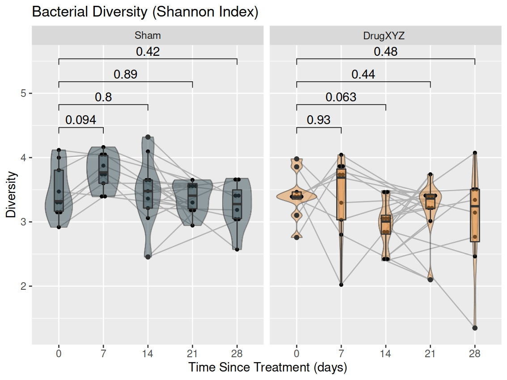
</p>

Alternatively, we may decide we want to look at whether the treatment affects alpha diversity between groups over time. For example, there may be some temporal element affecting alpha diversity that is independent of the treatment. This is easy to alter by changing the faceting variable, and removing the `geom_path()` element.

```r
# Transform the sample data into a data.frame
bact_data_samples <- data.frame(sample_data(bact_data_filtered))

# Prepare facet labels (more descriptive than the numbers alone)
# We will use the labeller within facet_grid to use these labels
facet_col_labels <- c('0' = '0 days post-Tx',
                      '7' = '7 days post-Tx',
                      '14' = '14 days post-Tx',
                      '21' = '21 days post-Tx',
                      '28' = '28 days post-Tx')

# Plot the diversity over time between groups
(bact_diversity_plot2 <- ggplot(bact_data_samples, aes(x = group, y = Diversity)) +
    geom_violin(aes(y = Diversity, fill = group), scale = 'area') +
    geom_dotplot(binaxis = 'y', stackdir = 'center', dotsize = 0.5, 
                 binwidth = 1/30 * diff(range(bact_data_samples$Diversity))) +
    geom_boxplot(aes(y = Diversity, fill = group), width = 0.2) +
    scale_fill_jama(alpha = 0.5, name = 'Treatment Group') +
    guides(fill = 'none') +
    labs(title = 'Bacterial Diversity (Shannon Index)',
         x = 'Treatment Group') +
    facet_grid(cols = vars(days_postTx), scales = 'free', labeller = as_labeller(facet_col_labels)) +
    stat_compare_means(comparisons = list(c('Sham', 'DrugXYZ')))
)
ggsave(here::here('figures', 'diversity', 'bact_diversity_by_time.pdf'), bact_diversity_plot2,
       width = 16, height = 12, units = 'cm')
```

That would produce this plot:

<p align="center">
    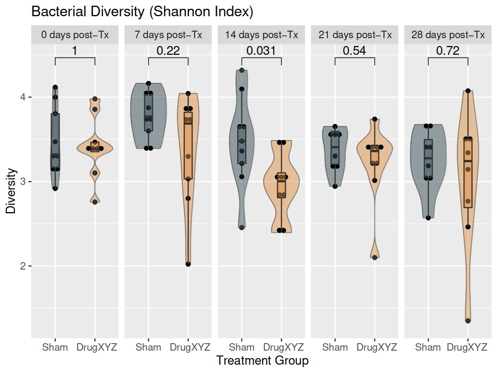
</p>

<kbd>[TOP OF PAGE](#microbiome-analysis)</kbd>

## Beta diversity

Beta diversity represents **between-sample** diversity. Continuing on from our example above, because the taxonomic composition may vary greatly with time, if we were to plot ordination plots for all samples together, we may lose clarity and minimise resolution/separation of data points at each of the time points individually.

In this example, the data came from 16S rRNA amplicon sequencing, so we have access to the *de novo* phylogenetic tree, and can use the UniFrac distance metric. UniFrac distances make use of the tree, by assigning short distances to a pair of ASVs that are highly similar, and larger distances to those that are more dissimilar.
If however we were using a `phyloseq` derived from shotgun metagenomic sequencing data, we could use another distance metric, e.g. Bray-Curtis (`'bray'`).

To save time and code, let's loop through the ordinations at each timepoint by creating temporary `phyloseq` subsets, add their plotted ordinations to a plot list, and finally combine the plots into a single figure with `ggarrange()`.

*If you just have a single categorical variable however, you can make use of the plot code within the loop, i.e. `p <- plot_ordination()` etc.*

```r
# Choose parameters for downstream analyses
met <- 'PCoA'
dist <- 'unifrac'
bact <- bact_data_logCSS

# Bacterial ordination (separately for each temporal group)
ord_list <- list() # blank list to hold ordination plots
for (day in levels(bact@sam_data$days_postTx)) { # loop through the unique values of 'days_postTx' in the phyloseq sample_data()
  bact_tmp <- prune_samples(bact@sam_data$days_postTx == day, bact) # create temporary subsets of the phyloseq object
  
  p <- plot_ordination(bact_tmp, ordinate(bact_tmp, met, dist, weighted = TRUE), # ordinate via the phyloseq plot_ordination() function
                       title = paste0(day, ' days post-treatment')) +
    stat_ellipse(aes(fill = group), geom = 'polygon', type = 't', level = 0.95, alpha = 0.2) + # add group ellipses
    scale_shape_identity() +
    geom_point(aes(fill = group), shape = 21, size = 3) + # add the individual data points
    scale_fill_jama(name = 'Treatment Group') # scale the fill colour using ggsci scale_fill_jama() function
  
  ord_list[[day]] <- p # add the plot to the plot list
}

# Arrange ordination plots using ggpubr ggarrange() function
ord_plots <- ggarrange(plotlist = ord_list, nrow = 2, ncol = 3, common.legend = TRUE)
(ord_plots <- annotate_figure(ord_plots,
                              top = text_grob(label = paste0('Bacteria ', met, ' ', dist, ' ordination'))))
ggsave(here::here('figures', 'ordination', 'bact_PCoA_ordination_by_time.pdf'), ord_plots, # Save combined figure
       width = 20, height = 16, units = 'cm')
```

The resulting output file looks like this:

<div align="center">
  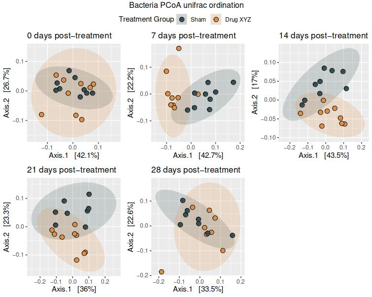
</div>

<kbd>[TOP OF PAGE](#microbiome-analysis)</kbd>

## Taxonomic composition

To investigate sample taxonomic composition, we can either look at the average composition of groups (using some sample metadata variable) or at the composition of each individual sample.

In either case, we will first need to filter the taxa using the `microbiome::core()` function to increase the clarity of the resulting barplots. We will place that within the `phyloseq::tax_glom()` function &ndash; to agglomerate to the genus level for example &ndash; and then transform the data to compositional form, and use the `phyloseq::psmelt()` function to pivot the data longer for plotting with `ggplot2`.

### Data preparation

```r
# Filter taxa to increase clarity of barplots
bact_data_tax <- psmelt(microbiome::transform(tax_glom(core(bact_data_filtered, detection = 10, prevalence = 0.2), 
                                                       'Genus', NArm = T), transform = 'compositional', target = 'OTU'))
```

Next, we will prepare a colour vector for the barplots using the `RColorBrewer` package.

```r
# Prepare colours for plotting
library(RColorBrewer)
qual_col_pals <- brewer.pal.info[brewer.pal.info$category == 'qual',]
col_vector <- unlist(mapply(brewer.pal, qual_col_pals$maxcolors, rownames(qual_col_pals)))
```

<kbd>[TOP OF PAGE](#microbiome-analysis)</kbd>

### Taxonomic barplot by group

We will first plot the "average" barplot using a grouping variable. This could be a treatment group, time frame, etc. In this example, we will continue on with the drug treatment example from above, using the treatment as our grouping variable and also facet by time frame (correcting the facet labels by passing the `facet_col_labels` vector we created above to the `labeller` argument of `facet_grid()`).

```r
# Plot taxonomic composition by group over time
(bact_taxonomy_gen <- ggplot(bact_data_tax, aes(x = group, y = Abundance, fill = Genus, NArm = FALSE)) +
    geom_bar(stat = 'identity', position = 'fill', size = 0.01) +
    scale_fill_manual(values = col_vector) + # use the colour vector we created
    labs(title = 'Genera Distribution vs Treatment Group',
         x = 'Treatment Group',
         y = 'Abundance') +
    theme(legend.key.size = unit(3.5, 'mm'), # change the size of each legend box
          legend.position = 'bottom',
          plot.margin = margin(0.25, 3, 0.25, 1.5, unit = 'cm'), # increase margins around the plot
          axis.text.x = element_text(angle = 45, vjust = 1, hjust = 1)) + # rotate x-axis labels
    facet_grid(cols = vars(days_postTx), labeller = as_labeller(facet_col_labels))
)
ggsave(here::here('figures', 'composition', 'bact_taxonomy_genera_by_time.pdf'), bact_taxonomy_gen,
       width = 20, height = 15, units = 'cm')
```

The resulting output file looks like this:

<div align="center">
  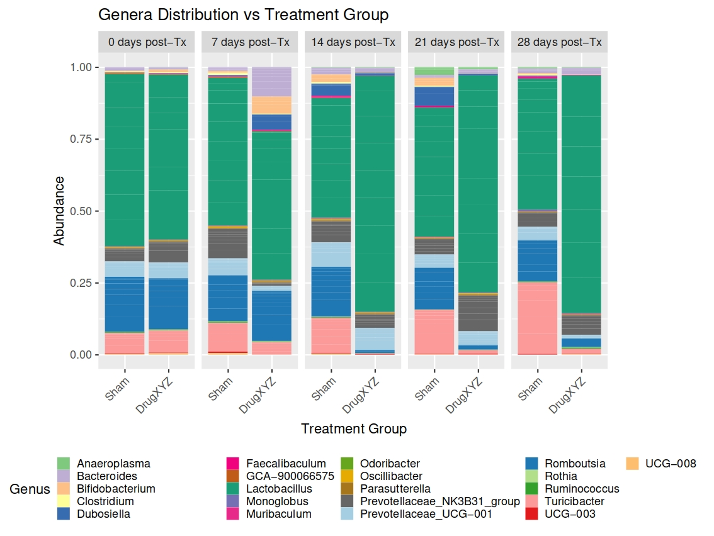
</div>

<kbd>[TOP OF PAGE](#microbiome-analysis)</kbd>

### Taxonomic composition by individual

Seeing as we also know the IDs of the animals, we can also plot the taxonomic composition for each individual over time, facetting by both group and time frame.

*We also need to add the treatment names to the end of the `facet_col_labels` vector here, because we are now facetting by two factors. The `labeller` just takes a single named vector for all labels.*

```r
# Barplot of abundance for each individual by group over time
(bact_taxonomy_gen_rat <- ggplot(bact_data_tax, aes(x = rat_id, y = Abundance, fill = Genus, NArm = FALSE)) +
    geom_bar(stat = 'identity', position = 'fill', size = 0.01) +
    scale_fill_manual(values = col_vector) +
    labs(title = 'Genera Distribution vs Treatment Group',
         x = 'Rat',
         y = 'Abundance') +
    theme(legend.key.size = unit(3.5, 'mm'),
          legend.position = 'bottom',
          plot.margin = margin(0.25, 3, 0.25, 2.25, unit = 'cm'),
          axis.text.x = element_text(angle = 45, vjust = 1, hjust = 1)) +
    facet_grid(row = vars(days_postTx), cols = vars(group), scales = 'free', labeller = as_labeller(c(facet_col_labels,
                                                                                                      'Sham' = 'Sham',
                                                                                                      'DrugXYZ' = 'DrugXYZ')))
)
ggsave(here('figures', 'composition', 'bact_taxonomy_gen_rat_by_time.pdf'), bact_taxonomy_gen_rat,
       width = 20, height = 20, units = 'cm')
```

The resulting output file looks like this:

<div align="center">
  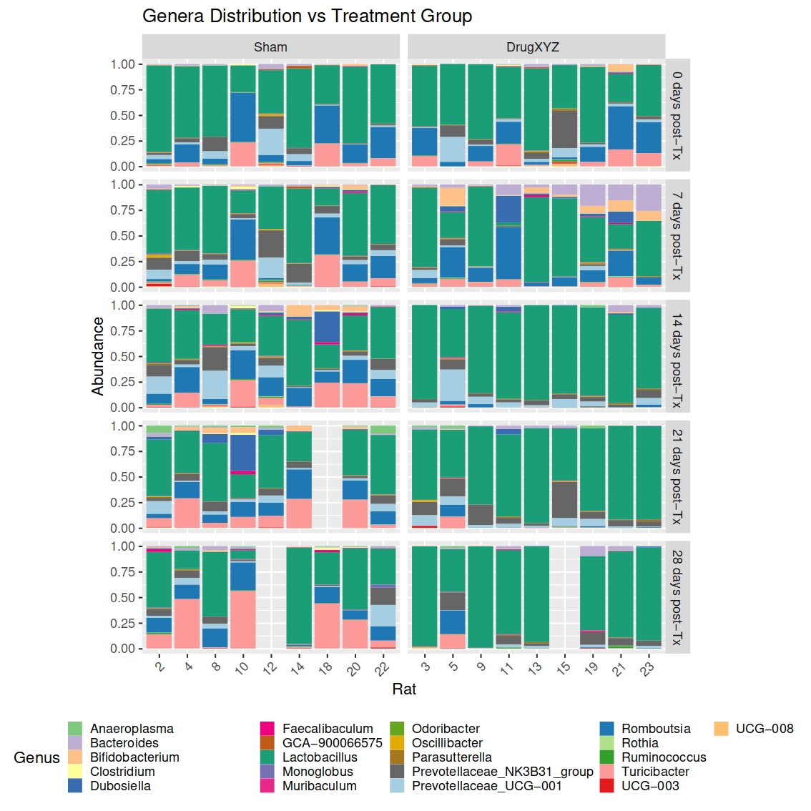
</div>

<kbd>[TOP OF PAGE](#microbiome-analysis)</kbd>

## Ratios between bacterial phyla

In particular the ratio between Firmicutes and Bacteroidetes is a popular measure, often used in assessing the health of the gastrointestinal microbiome. That said, we can look at the ratios of all phyla using the [`phyla_ratios()`](./phyla_ratios.R) function we provide here.

### Arguments for `phyla_ratios()`

- `phyloseq_object`: a `phyloseq` object to use for differential abundance testing. This should be a `phyloseq` object containing raw (not normalised) counts.
- `test_variable`: the name of a **single** column from the `sample_data` to be used for comparison of phyla ratios.
- `average_reads_threshold` (default = 1000): optional - the minimum number of reads per sample on average that a phylum should have in order to be retained for analysis of ratios. Assessed by multiplying this value by the number of samples &ndash; if the row sums of a given phylum have less than `average_reads_threshold * number of samples`, it will be removed. 
- `plot_output_folder`: optional - the path to a folder where you would like output plots to be saved. If left blank, no plots will be saved.
- `plot_file_prefix`: optional - a string to attach to the start of the individual file names for your plots. This input is only used if the `plot_output_folder` argument is also provided.

### Function output

- `phyla_ratios`: a data.frame of the input data for each phylum-phylum comparison that passed thresholding, along with the ratio and test_variable.
- `phyla_ratio_plots`: a `ggplot2` plot of each phylum-phylum comparison that passed thresholding, with either a Wilcoxon or Kruskal-Wallis statistic depending on the number of groups.
- `stats_all`: a data.frame containing all pair-wise Wilcoxon Rank Sum testing statistics for each comparison.
- `stats_signif`: a filtered version of `stats_all` containing only those comparisons with a p-value < 0.5.

An example of the output `.pdf` file is shown here:

<div align="center">
  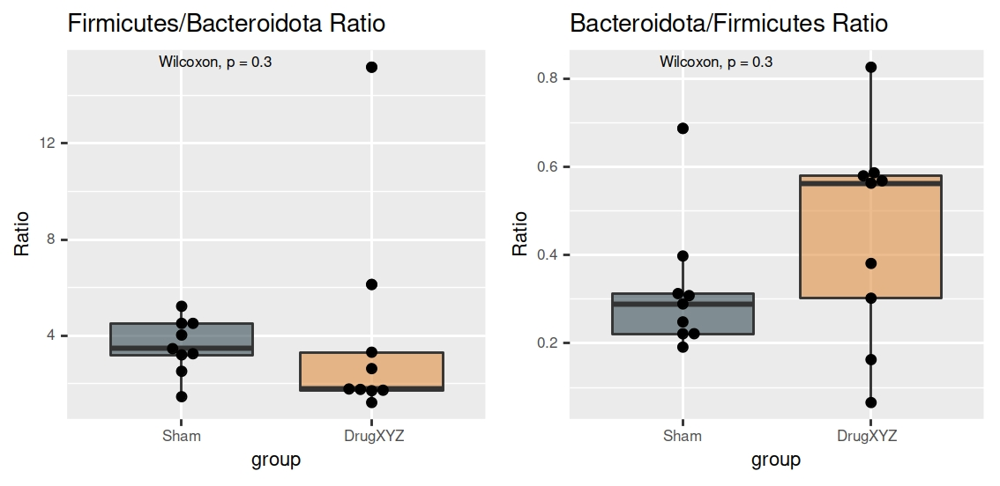
</div>

<kbd>[TOP OF PAGE](#microbiome-analysis)</kbd>

## Limma wrapper function for differential abundance testing

Say we now want to see whether there are bacteria that are differentially abundant according to a sample metadata variable we have available. Perhaps we have information about an individual's age at sampling, or we have some grouping information. This information can be input into a custom wrapper function around the popular `limma` package we provide here, called [`phyloseq_limma()`](./phyloseq_limma.R).

The minimum required arguments for `phyloseq_limma()` are:

- `phyloseq_object`
- `model_formula_as_string` or `metadata_var`
- `coefficients` (not required in using `metadata_var`)

### Arguments for `phyloseq_limma()`

- `phyloseq_object`: a `phyloseq` object to use for differential abundance testing.
- `metadata_var`: optional - the name of a **single** column from the `sample_data` to use for DA testing (e.g. `metadata_var = 'group'`). **NOT** required if providing a formula - it will be changed to `NULL` if `model_formula_as_string` is also provided.
- `metadata_condition`: optional - a conditional statement about a certain metadata value, e.g. keeping a certain age group only.
- `model_matrix`: optional - best to let the function create the model matrix for you.
- `model_formula_as_string`: just like it sounds - a string containing the model formula you want to use (only works with '+' and not '*' at this stage).
- `use_contrast_matrix`: a boolean selector for whether to use the contrast matrix or a selected coefficient - the function should select the correct option.
- `coefficients`: selection of coefficient(s) you want to be tested. This will depend on the order of variables in the formula, and you can select as many as you'd like (e.g. `coefficients = 2`, or `coefficients = 3:4`).
- `factor_reorder_list`: optional - a named list containing reordered factor values, e.g. `list(Group = c('GroupHealthy', 'GroupTreatment1', 'GroupTreatment2'))`
- `continuous_modifier_list`: optional - a named list containing functions to alter continuous variables, e.g. `list(Age = function (x) x / 365)` to change ages in days to ages in years.
- `contrast_matrix`: optional - best to let the function create the contrast matrix for you.
- `adjust_method`: optional - the method used to correct for multiple comparisons, listed [here](https://www.rdocumentation.org/packages/stats/versions/3.6.2/topics/p.adjust).
- `rownames`: optional - a custom vector of names to be used if you don't wish the names to be automatically derived from taxonomy.
- `tax_id_col`: optional - the phyloseq object `tax_table` column you wish to use for naming - this should match the level being tested (and should also match the deepest taxonomic level in the phyloseq object - if you want to test a higher level then agglomerate the data using the `phyloseq::tax_glom()` function). If you do not provide this, then the function will automatically select the deepest level (i.e. the right-most `tax_table` column that isn't comprised of all `NA` values).
- `adj_pval_threshold` (default = 0.05): the minimum level deemed significant.
- `logFC_threshold` (default = 1): the minimum log-fold change deemed meaningful.
- `legend_metadata_string`: optional - a custom name for colour or fill options.
- `volc_plot_title`: optional - a custom title for the volcano plot (will be reused for the associated bar plots and individual feature plots).
- `volc_plot_subtitle`: optional - a custom subtitle for the volcano plot (will be reused for the associated bar plots and individual feature plots).
- `volc_plot_xlab`: optional - a custom x label for the volcano plot.
- `volc_plot_ylab`: optional - a custom y label for the volcano plot.
- `remove_low_variance_taxa` (default = FALSE): optional - if TRUE, the phyloseq OTU table will be checked for feature-wise variance, and all features with zero variance will be removed prior to downstream analysis. Limma may throw an error if most of the features have no variance, so this step is sometimes required for certain datasets.
- `plot_output_folder`: optional - the path to a folder where you would like output plots to be saved. If left blank, no plots will be saved.
- `plot_file_prefix`: optional - a string to attach to the start of the individual file names for your plots. This input is only used if the `plot_output_folder` argument is also provided.

### Function output

The function will return a list with different outputs from the function.

- `input_data`: the original OTU data used to run the analysis.
- `input_metadata`: a data.frame with the original metadata you provided.
- `test_variables`: a data.frame with the subset of metadata variables used for the analysis.
- `model_matrix`: the model matrix generated (or provided) to the function.
- `constrast_matrix` OR `coefficients`: either the contrast matrix used, or the coefficients selected, depending on the analysis you chose to run.
- `limma_significant`: a list of data.frames containing the signficant taxa determined by the limma function, with the adjusted p-value and logFC threshold selected, for each comparison/coefficient.
- `limma_all`: a list of data.frames containing the significance levels of DA analysis for all taxa for each comparison/coefficient.
- `volcano_plots`: volcano plots for each of the comparisons/coefficients selected.
- `bar_plots`: bar plots combining significant features for each of the comparisons/coefficients selected. The x-axis shows the log2FC value calculated by limma, with feature names on the y-axis, ordered by the effect magnitude.
- `feature_plots`: individual box plots for each feature, for each of the comparisons/coefficients selected. A significance bar will only be shown for the groups being compared, however all groups (if there are more than two) will be plotted for reference.
- `venn_diagram`: a Venn diagram that will show up when you run the function.

If a plot output folder path is provided, for each comparison/coefficient you have selected, three output .pdf files will be generated (provided there is at least 1 significant difference detected):

- `{plot_file_prefix}_{test_variable + group}_volcplot.pdf`: a volcano plot showing all features, with significant feaetures labelled, decreased features in blue and increased features in red.
- `{plot_file_prefix}_{test_variable + group}_barplot.pdf`: a bar plot showing significant features, with the log2FC on the x-axis and feature name on the y-axis. The y-axis is ordered by the log2FC magnitude, with the lowest at the bottom and highest at the top. Negative log2FC features are coloured blue, while positive ones are coloured red. The output plot automatically resizes depending on the number of variables being plotted.
- `{plot_file_prefix}_{test_variable + group}_featureplots.pdf`: individual box plots for each feature, for each of the comparisons/coefficients selected. A significance bar will only be shown for the groups being compared, however all groups (if there are more than two) will be plotted for reference. These plots are arranged with 12 features to a page (3 columns and 4 rows). Multiple pages will be combined into a single output .pdf file if there are more than 12 significant features.

<kbd>[TOP OF PAGE](#microbiome-analysis)</kbd>

### Continuous example

If we have longitudinal microbiome sampling, we may want to know which taxa change with time. As there is likely to be little change on a day-to-day basis, we can also modify the age information from days to years. Furthermore, we can even control for potentially confounding factors like individual variation.

```{r}
# Run custom limma continuous function for taxa vs age
bact_limma_age <- phyloseq_limma(phyloseq_object = bact_kraken2_logCSS,
                                 model_formula_as_string = '~ Age + Individual',
                                 continuous_modifier_list = list(Age = function (x) x / 365),
                                 coefficients = 2,
                                 volc_plot_title = 'Differentially Abundant Taxa over Time',
                                 volc_plot_xlab = 'log2FC/year')

# View volcano plot
bact_limma_age$volcano_plots$Age
```

This will produce a volcano plot that looks something like this (the taxa names have been omitted, but will normally appear):

<div align="center">
  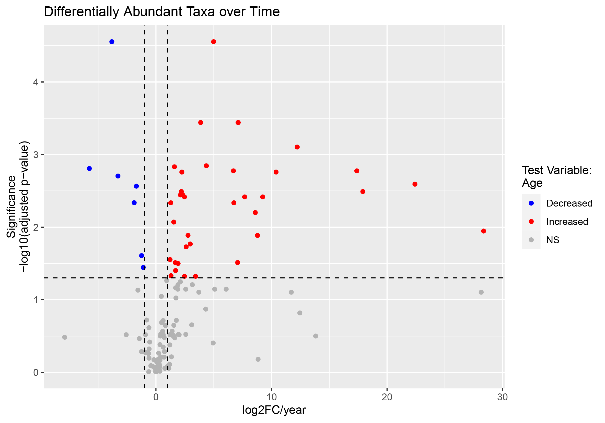
</div>

In another example looking at differences between treatment groups, the bar plot produced looks like this:

<div align="center">
  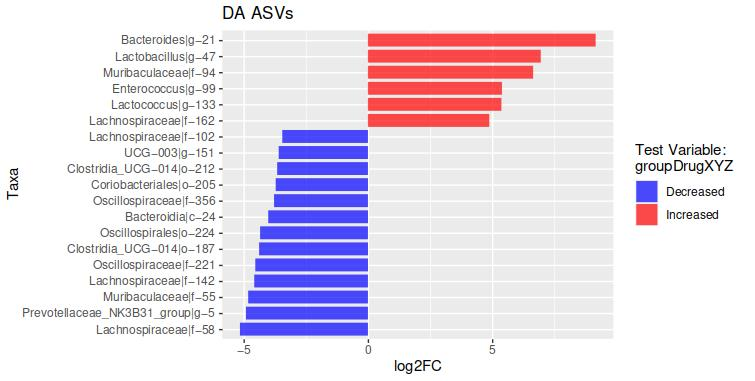
</div>

An example of the feature plots output for a categorical explanatory variable is shown here:

<div align="center">
  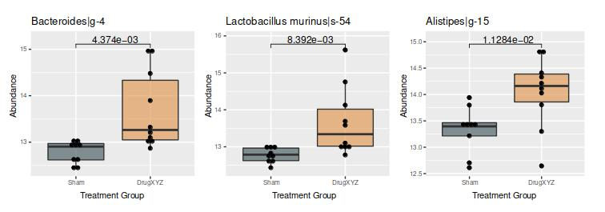
</div>

Or an example of the feature plots output for a continuous explanatory variable is shown here:

<div align="center">
  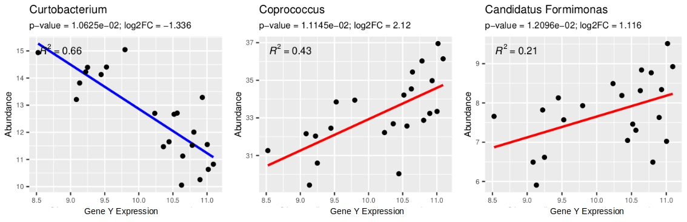
</div>

<kbd>[TOP OF PAGE](#microbiome-analysis)</kbd>

### Splitting a phyloseq object for differential abundance analysis

When we split up the phyloseq temporarily for investigation of [beta diversity](#beta-diversity), we saw that there appears to be some good separation of groups at days 7, 14, and 21 post-treatment. Therefore we will probably decide to do some differential abundance testing, and the `phyloseq_limma()` function above can handle this for us, as well as generate and save all of the relevant exploratory plots we will want initially to inspect the differences between groups.

Because lists are a great way to keep everything organised (and minimise the growing number of variables in your R environment), we will separate the `phyloseq` object into multiple subsets (one for each time point), and store these within a list called `input_data`, which itself sits inside a main list that will house both the input data and the results from statistical analyses of that input data &ndash; you may want to run several variations with different statistical thresholds or test variable combinations for example. By storing everything in a master list, you keep all the inputs and outputs together.

#### Creating the master list

We will separate the bacteria by time and store these "sub-`phyloseq` objects" within a container list called `input_data`. This container object is a sub-list that contains each of the datasets separated by time, and sits inside a "master list" that will also hold any statistical tests we run on the data.

```r
# Split the data by time
bact_time_split <- list(input_data = list(day0 = subset_samples(bact_data_logCSS, days_postTx == '0'),
                                          day7 = subset_samples(bact_data_logCSS, days_postTx == '7'),
                                          day14 = subset_samples(bact_data_logCSS, days_postTx == '14'),
                                          day21 = subset_samples(bact_data_logCSS, days_postTx == '21'),
                                          day28 = subset_samples(bact_data_logCSS, days_postTx == '28')))
```

The data now has the following structure:

```r
bact_time_split # class = list
  |
  |---input_data # class = list
        |
        |---day0 # class = phyloseq
        |---day7 # class = phyloseq
        |---day14 # class = phyloseq
        |---day21 # class = phyloseq
        |---day28 # class = phyloseq
```

<kbd>[TOP OF PAGE](#microbiome-analysis)</kbd>

#### Looping through the master list to test for DA taxa

From here, we can loop through the `phyloseq` objects contained within the `input_data` list, and run `phyloseq_limma()`.

```r
# Loop over the custom phyloseq_limma function
bact_time_split$limma_groupDA_ASV <- list() # create an empty list to store outputs
for (day in names(bact_time_split$input_data)) { # loop over the names in 'input_data', assigning each successively to the 'day' variable
  bact_phyloseq <- bact_time_split$input_data[[day]] # retrieve the appropriate phyloseq object
  limma_groupDA <- phyloseq_limma(phyloseq_object = bact_phyloseq,
                                  model_formula_as_string = '~ group',
                                  coefficients = 2,
                                  plot_output_folder = here::here('figures', 'limma_DA', 'treatment_group', 'ASV'), # output plots will be saved here
                                  plot_file_prefix = paste0('tx_group_', day),
                                  volc_plot_title = paste0('DA ASVs - ', day, ' post-treatment'))
  bact_time_split$limma_groupDA_ASV[[day]] <- limma_groupDA # add the output from the limma function to the list
}
```

After this step, our data now has the following structure:

```r
bact_time_split # class = list
  |
  |---input_data # class = list
  |     |
  |     |---day0 # class = phyloseq
  |     |---day7 # class = phyloseq
  |     |---day14 # class = phyloseq
  |     |---day21 # class = phyloseq
  |     |---day28 # class = phyloseq
  |
  ----limma_groupDA_ASV # class = list
        |
        |---day0 # class = list
        |     |
        |     |---input_data # class = data.frame
        |     |---input_metadata # class = data.frame
        |     |---test_variables # class = data.frame
        |     |---model_matrix # class = double
        |     |---coefficients # class = double
        |     |---limma_significant # class = list
        |     |     |
        |     |     |---groupDrugXYZ # class = data.frame
        |     |
        |     |---limma_all # class = list
        |     |     |
        |     |     |---groupDrugXYZ # class = data.frame
        |     |
        |     |---volcano_plots # class = list
        |     |     |
        |     |     |---groupDrugXYZ # class = ggplot
        |     |
        |     |---bar_plots # class = list
        |     |     |
        |     |     |---groupDrugXYZ # class = ggplot
        |     |
        |     |---feature_plots # class = list
        |     |     |
        |     |     |---groupDrugXYZ # class = list
        |     |           |
        |     |           |---significant_feature1 # class = ggplot
        |     |           |---significant_feature2 # class = ggplot
        |     |           |---etc.
        |     |
        |     |---venn_diagram
        |
        |---day7 # class = list (as per day0)
        |---day14 # class = list (as per day0)
        |---day21 # class = list (as per day0)
        |---day28 #class = list (as per day0)
```

The major benefit of organising our data in this way is that is keeps all analyses we run combined in the same place. We could even choose to organise our data this way even if we weren't splitting the original `phyloseq`.

In the same way that we added the empty `limma_groupDA_ASV` list to our master list, we could add another empty list, e.g. `limma_geneY_ASV`, to look at how microbial abundance may be altered by expression of "gene Y", or any other number of variables. 

The main thing is that all analyses relating to a particular `phyloseq` object or set of split `phyloseq` objects are contained in the same place. How tidy!

<kbd>[TOP OF PAGE](#microbiome-analysis)</kbd>

## Limma model selection

If we have a selection of sample metadata that we are unsure whether or not to include in the model formula for `phyloseq_limma()`, we can use a wrapper around the `limma::selectModel()` function called `limma_best_model()`, provided [here](./limma_best_model.R).

The function takes the primary variable you want to test, a set of additional variables you want to assess for inclusion, and the `phyloseq` object for testing. You can also choose between Akaike's Information Criterion (AIC) or Bayesian Information Criterion (BIC) as your selection methods.

### Arguments for `limma_best_model()`

- `phyloseq_object`: the `phyloseq` object you are assessing model fits for &ndash; this should be the same as the object you will use inside `phyloseq_limma()`.
- `key_variable`: the name of the `sample_data` column of the variable you are interested in testing differential abundance for.
- `other_parameters`: a character vector of other `sample_data` columns you want to assess to determine whether they improve the fit of the model.
- `selection_metric` (default = `'bic'`): the selection criterion metric you want to use to compare different model fits. The default is the BIC metric, but you can also use AIC (by changing the argument to `'aic'`).

### Function output

The function will output a list with the following elements:

- `formula_string`: the best model formula as a string (for direct use in `phyloseq_limma()`)
- `key_var_coef`: the coefficients of the model that contain the `key_variable`, for direct use in `phyloseq_limma()`.
- `scores_plot`: a plot of the top 10 models. The x-axis of the plot shows the percentage of input taxa in your `phyloseq` object for which a given model is the best.
- `model_scores`: a `data.frame` with the model scores output information.
- `selection_metric`: a string containing the selection criterion metric you used, either `'AIC'` or `'BIC'`.

### Example

An example of using this function is as follows:

```r
# Determine the best model
bestmodel <- limma_best_model(phyloseq_object = bact_data_logCSS,
                              key_variable = 'gene_expression_IL1a_brain_log',
                              other_parameters = c('treatment', 'injury', 'sex'),
                              selection_metric = 'bic')
bestmodel$scores_plot
```

The output plot looks like this:

<div align="center">
  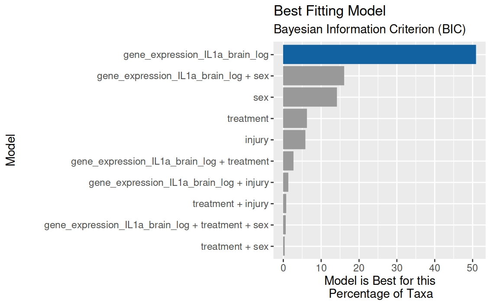
</div>

### Use of the output within `phyloseq_limma()`

The `phyloseq_limma()` function ideally wants to be given a model formula as a string and the coefficients it should be using. Therefore, we can use the outputs of `limma_best_model()` directly within the call to `phyloseq_limma()`, as shown here:

```r
limma_il1a <- phyloseq_limma(phyloseq_object = bact_data_logCSS,
                             model_formula_as_string = bestmodel$formula_string,
                             coefficients = bestmodel$key_var_coef)
```

## Rights

* Copyright &copy; 2022 &ndash; Mucosal Immunology Lab, Melbourne VIC, Australia
* Licence: These tools are provided under the MIT licence (see LICENSE file for details)
* Authors: M. Macowan